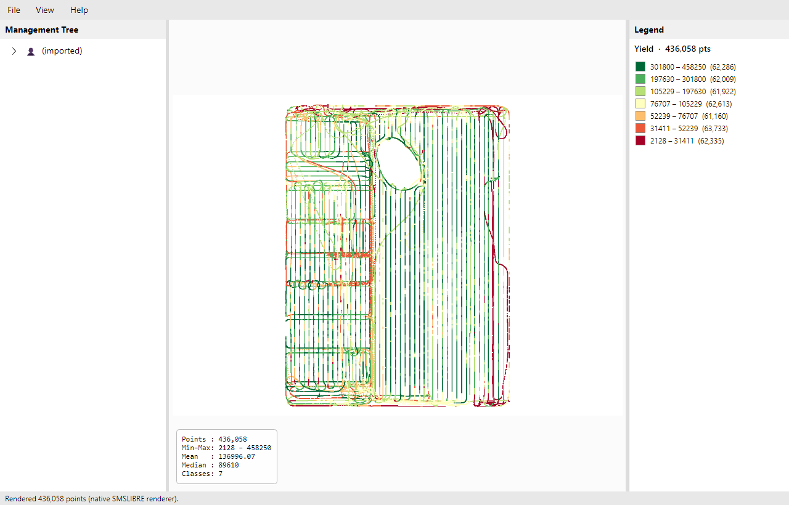

# SMSLIBRE

A native **Linux** application aiming at full feature parity with **Ag Leader SMS
Advanced** (a Windows-only precision-agriculture desktop app), built by **reusing
SMS's own portable .NET code** where possible and reimplementing only the parts
locked in its native C++ engine.

Personal, non-commercial reverse-engineering & porting project. Nothing
proprietary is redistributed here — decompiled sources, vendor DLLs, sample field
data, and the DB schema are git-ignored and regenerable from an SMS install.

## Why this is feasible

- SMS is **.NET + C++/CLI + WPF**, not native C++ as first assumed; storage is
  **Access/JET**, not SQL Server. → [`notes/STAGE1-3_FINDINGS.md`](notes/STAGE1-3_FINDINGS.md)
- Its multi-vendor **import engine is the open-source AgGateway ADAPT** library,
  which runs on native Linux .NET — **proven** by running SMS's actual
  `ISOv4Plugin.dll` outside SMS. → [`notes/STAGE_SALVAGE_LEDGER.md`](notes/STAGE_SALVAGE_LEDGER.md)
- ~45k methods of SMS's code are readable/portable C#; the compute engine
  (cleaning/analysis/rendering) is native machine code that gets reimplemented.
- Full scope: **835 SMS features** catalogued. → [`notes/SMS_FEATURE_INVENTORY.md`](notes/SMS_FEATURE_INVENTORY.md)

## Status

Vertical slice working (Phase 1): import an ISOXML dataset with **SMS's own ADAPT
engine**, browse a Grower/Farm/Field tree, render a classified yield map with a
native renderer, export PNG — in an Avalonia UI. Roadmap:
[`notes/PROJECT_PLAN.md`](notes/PROJECT_PLAN.md) · parity tracker:
[`notes/FEATURE_PARITY.md`](notes/FEATURE_PARITY.md)



## Repository layout

```
app/        native .NET + Avalonia application  (see app/README.md)
  src/SmsLibre.Core     domain model, native yield renderer, cleaning, PNG writer
  src/SmsLibre.Import   reuses SMS's AgGateway.ADAPT.* DLLs to import field data
  src/SmsLibre.App      Avalonia UI (tree | map | legend)
  src/SmsLibre.Cli      headless import + render
  tests/                Core unit tests (CI) + Import integration tests (local)
notes/      analysis write-ups, feature inventory, salvage ledger, project plan
tools/      RE + analysis scripts (PE inventory, decompiler, schema export, …)
smslibre/   earlier Python + Qt proof of concept
analysis/   generated artifacts (mostly git-ignored)
```

## Build

Requires the .NET SDK (8+). The app's importer needs the AgGateway ADAPT DLLs
from an SMS install (`SmsNetCoreDir`); Core builds with no such dependency.

```bash
# Core + its tests (no SMS install needed)
dotnet test app/tests/SmsLibre.Core.Tests -c Release

# Full app (needs SMS's ADAPT DLLs; on Linux point at your install)
dotnet build app/SmsLibre.sln -c Release -p:SmsNetCoreDir=/path/to/SMS/NetCoreDependencies
dotnet run --project app/src/SmsLibre.App -c Release
```

## License / provenance

The SMSLIBRE code here is the author's own. "SMS", "Ag Leader", ADAPT, and the
various manufacturer formats belong to their respective owners; this project
interoperates with data the user already owns and does not redistribute vendor
software.
